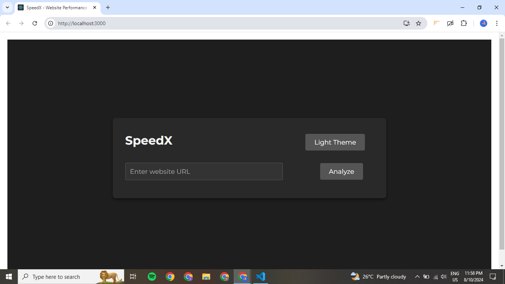
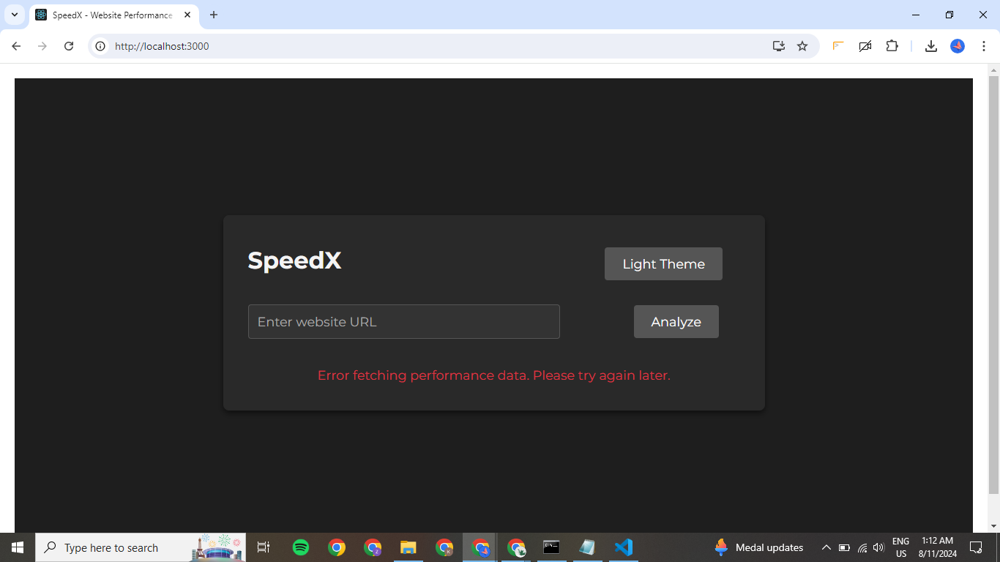
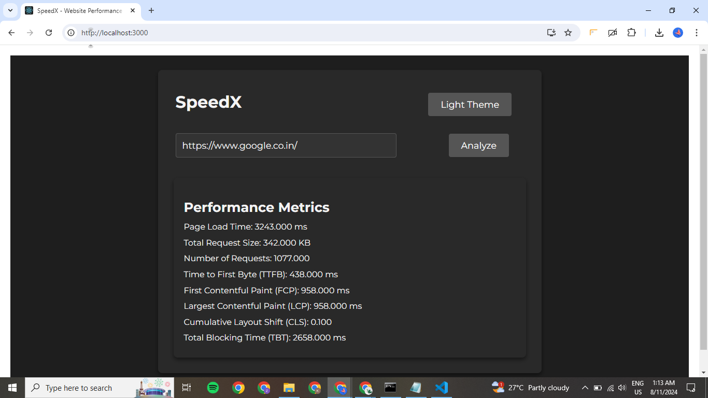
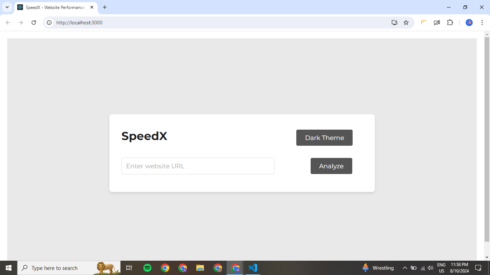
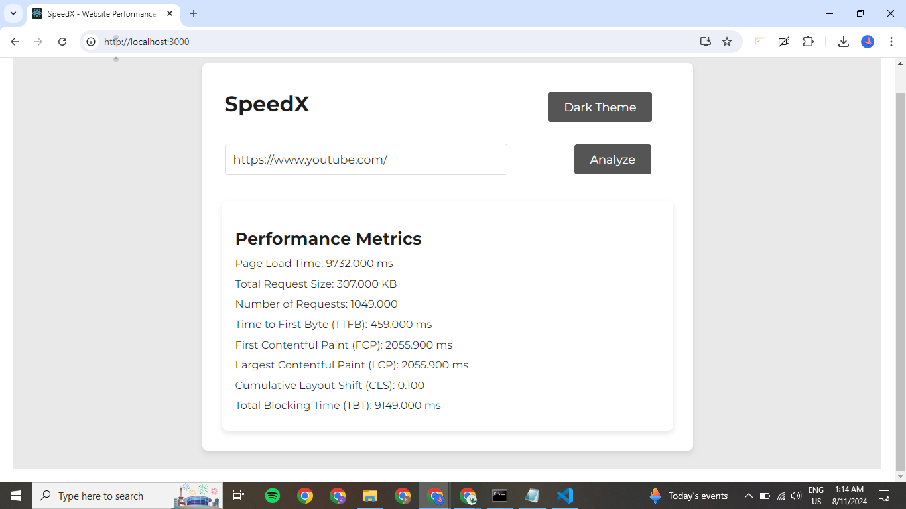

# SpeedX - Website Performance Analyzer



## Overview

SpeedX is a web application designed to analyze website performance metrics. It provides detailed insights into various performance aspects of a webpage, helping developers optimize their websites for better user experience.

## Features

- **URL Input**: Enter any website URL to analyze its performance.
- **Analyze Button**: Trigger the performance analysis with a single click.
- **Loading State**: Visual indicator while the analysis is being performed.
- **Error Handling**: Clear error messages in case of issues during analysis.
- **Dark/Light Theme**: Toggle between dark and light themes for better readability.
- **Performance Metrics**:
  - **Page Load Time**: Time taken for the page to fully load.
  - **Total Request Size**: Combined size of all requests made by the page.
  - **Number of Requests**: Total number of requests made by the page.
  - **Time to First Byte (TTFB)**: Time taken for the first byte of the response to be received.
  - **First Contentful Paint (FCP)**: Time taken for the first contentful paint to occur.
  - **Largest Contentful Paint (LCP)**: Time taken for the largest contentful paint to occur.
  - **Cumulative Layout Shift (CLS)**: Visual stability of the page.
  - **Total Blocking Time (TBT)**: Total time the page is blocked from responding to user input.

## Technologies Used

- **React**: For building the user interface.
- **Node.js and Express**: For creating the backend server.
- **Axios**: For making HTTP requests from the frontend to the backend.
- **Puppeteer**: For controlling a headless browser and gathering performance metrics.
- **CSS**: For styling the application, including dark and light themes.
- **Google Fonts**: For consistent and attractive typography using the 'Montserrat' font.

## APIs and Products Used

- **Custom Performance Analysis API**:
  - A custom-built API endpoint provided by the backend server. It accepts a URL, performs performance analysis using Puppeteer, and returns various performance metrics.
- **Google Fonts API**:
  - Used to import and apply the 'Montserrat' font family to the application for consistent typography.

## Installation and Setup

1. **Clone the repository**:
   ```sh
   git clone https://github.com/your-username/speedx.git
   cd speedx
   ```
2. **Install dependencies**:
   ```sh
   npm install
   ```
3. **Start the backend server**:
   ```sh
   cd backend
   node server.js
   ```
4. **Start the frontend application**:
   ```sh
   cd frontend
   npm start
   ```
5. **Open the application**:
   - Open your browser and navigate to http://localhost:3000

## Acknowledgements

- Special thanks to the developers of React, Node.js, Express, Puppeteer, and Axios for their amazing tools.
- Inspired by various online resources and tutorials on web performance optimization.

## Contact

For any inquiries or feedback, please reach out to Krishna Bhatt at bhatt.krishna.0023@gmail.com.
